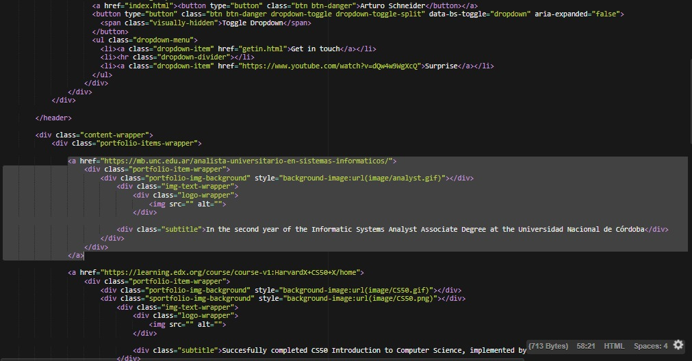
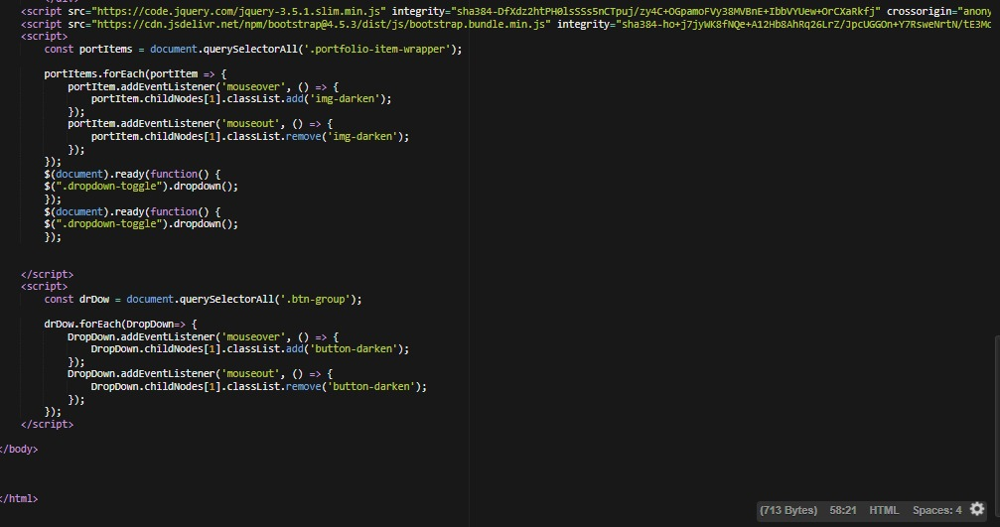

# Introfy

Introfy is an interactive website to introduce yourself to people, and get them to know about your personal profile, academic activities, work experience, goals, interests or aby information
you want to show in fancy way.

This readme provides more information on how you can implement your own version of Introdufy with your the info you want to share with others.

## Video Demo
See video presentation [here!](https://www.youtube.com/watch?v=x8jxE_14plM&t=11s)

## Requirements
You will need any code editor software that support:
- HTML5
- CSS3
- JS ES2015.

I recommend you to install Visual Studio Code, which is a powerful tool. You can download it safely and for free [here!](https://visualstudio.microsoft.com/vs/community/)


## Description

The web site was thought for those who are seeking for a way to get people to know with precision their academic, work and experience paths, maybe for a
job selection proccesses, an interview or scolarships.

For that, the site gives the user the opportunity to create an interactive personal site which has all the information needed and the links
to redirect end-users, recruiters or coleagues to web sites where study programs, certificates, information about organizations, grades, etc. can be found.

Inside "project"  folder you will find a sub-folder called homepage [homepage](homepage/image/homepage.jpeg) where the .HTML and .CSS
files are.

## Steps

1. Open "index.html" you will see this at the "<head>" of the file:
[index1](homepage/image/index1.jpeg)

```<head>
        <meta charset="UTF-8">
        <meta name="viewport" content="width=device-width, initial-scale=1">
        <title>Arturo Schneider</title>
        <link rel="preconnect" href="https://fonts.gstatic.com">
        <link href="https://fonts.googleapis.com/css2?family=Ubuntu:wght@300;700&display=swap" rel="stylesheet">
        <link href="https://cdn.jsdelivr.net/npm/bootstrap@5.0.0-beta3/dist/css/bootstrap.min.css" rel="stylesheet" integrity="sha384-eOJMYsd53ii+scO/bJGFsiCZc+5NDVN2yr8+0RDqr0Ql0h+rP48ckxlpbzKgwra6" crossorigin="anonymous">
        <link rel="stylesheet" href="styles.css">
    </head>
```
You can add or change the fonts used from google fonts

2. Down in the "<body>" you will be able to change the text on the dropdown just by changing plain text here:
[body](homepage/image/body.jpeg)

```<div class="btn-group">
      <a href="index.html"><button type="button" class="btn btn-danger">YOUR NAME</button></a>
      <button type="button" class="btn btn-danger dropdown-toggle dropdown-toggle-split" data-bs-toggle="dropdown" aria-expanded="false">
        <span class="visually-hidden">Toggle Dropdown</span>
      </button>
      <ul class="dropdown-menu">
        <li><a class="dropdown-item" href="getin.html">WHATEVER SECTION YOU WANT</a></li>
        <li><hr class="dropdown-divider"></li>
        <li><a class="dropdown-item" href="https://www.youtube.com/watch?v=dQw4w9WgXcQ">WHATEVER SECTION YOU WANT</a></li>
      </ul>
    </div>
```
3. After that you will need to change the titles of the images, the descrptions and the images itself.
You can do that just by modyfing the text and giving the correct URLs to the images.

```<a href="https://mb.unc.edu.ar/analista-universitario-en-sistemas-informaticos/">
        <div class="portfolio-item-wrapper">
            <div class="portfolio-img-background" style="background-image:url(image/analyst.gif)"></div>
                <div class="img-text-wrapper">
                    <div class="logo-wrapper">
                        
                    </div>
                <div class="subtitle">In the second year of the Informatic Systems Analyst Associate Degree at the Universidad Nacional de Córdoba</div>
            </div>
        </div>
    </a>
```
Each element on the "grid" of the site is implemented as a tag link with an "a" tag which has nested divs tags. Each of those divs are responsible for the behaviour of images and text in different events.

4. At the bottom you will find script tags which has EvenListeners to manage the behaviour of the elements on click, hover or mouseover. That gives the website
a more dynamic approach:

```<script>
        const portItems = document.querySelectorAll('.portfolio-item-wrapper');

        portItems.forEach(portItem => {
            portItem.addEventListener('mouseover', () => {
                portItem.childNodes[1].classList.add('img-darken');
            });
            portItem.addEventListener('mouseout', () => {
                portItem.childNodes[1].classList.remove('img-darken');
            });
        });
        $(document).ready(function() {
        $(".dropdown-toggle").dropdown();
        });
        $(document).ready(function() {
        $(".dropdown-toggle").dropdown();
        });


    </script>
    <script>
        const drDow = document.querySelectorAll('.btn-group');

        drDow.forEach(DropDown=> {
            DropDown.addEventListener('mouseover', () => {
                DropDown.childNodes[1].classList.add('button-darken');
            });
            DropDown.addEventListener('mouseout', () => {
                DropDown.childNodes[1].classList.remove('button-darken');
            });
        });
    </script>
```
5. Appart from that you will find th .css files where you will find the aesthetics for each element for its own class. I strongly encourage you to feel free to play a little
until you give the site your personal touch!
As an brief example you can do so by changing the attributes of the .img-text-wrapper .subtitle where you can change color, size, justify the text and more:

## ¡Thanks!
IT's been a pleasure to be a part of such a high end course, which has given the opportunity to learn and get in touch with people from different countries and backgrounds.
It's been an incredible journey and I couldn't be more grateful to everyone involved. Again, THANKS A LOT!

## NO ENDORSEMENT
For this project there is no endorse to any commercial product or service, including any subjects of analysis. Any reference to specific commercial products,
processes, or services by service mark, trademark, manufacturer, or otherwise, does not constitute or imply their endorsement, recommendation, or favoring

